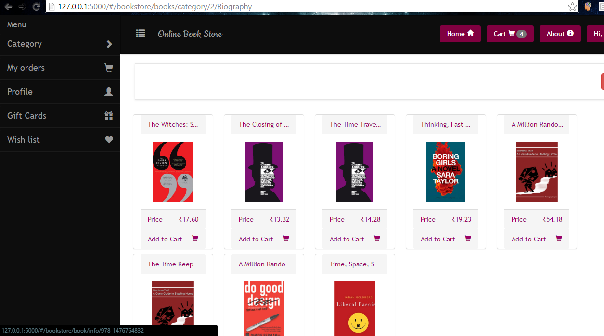
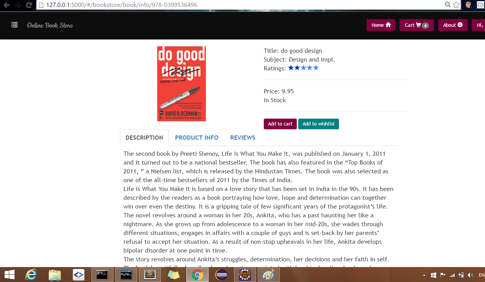
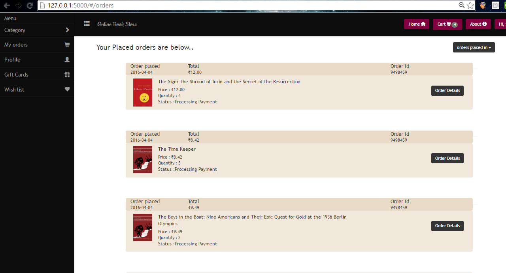
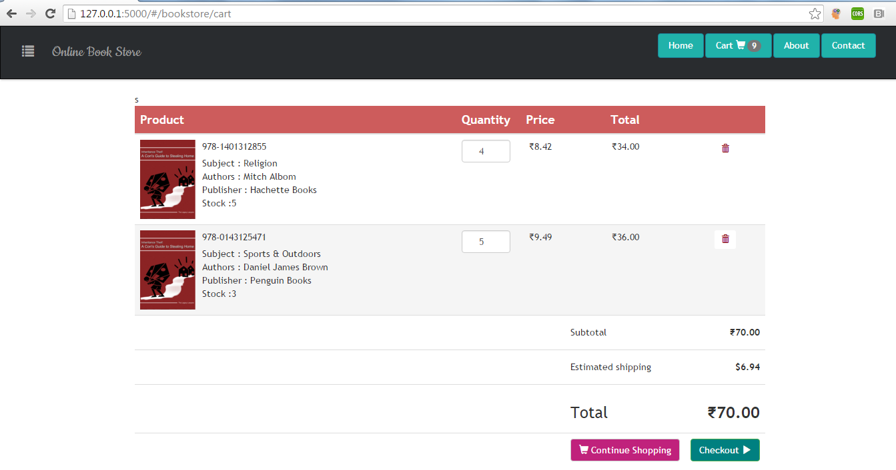
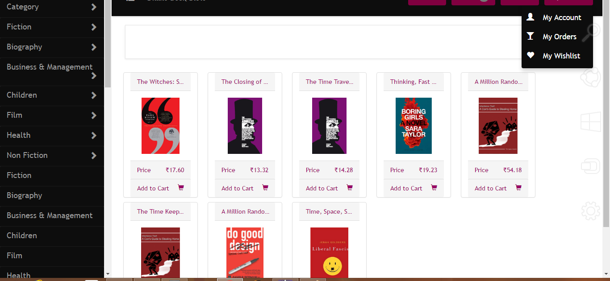
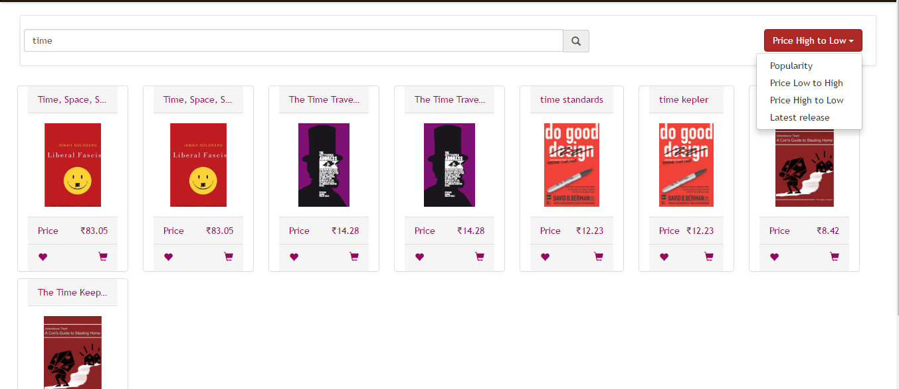
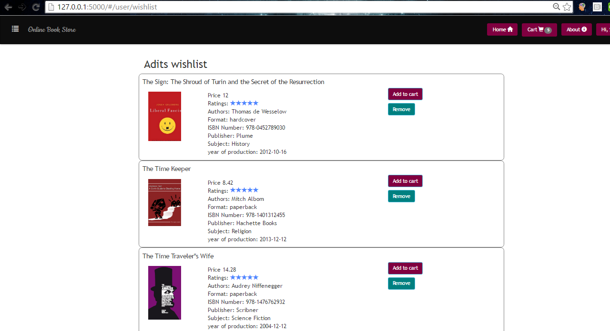
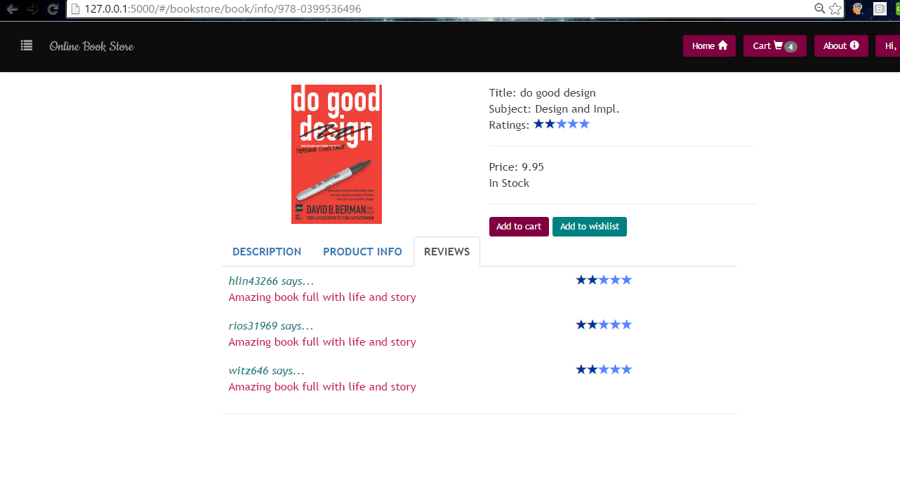
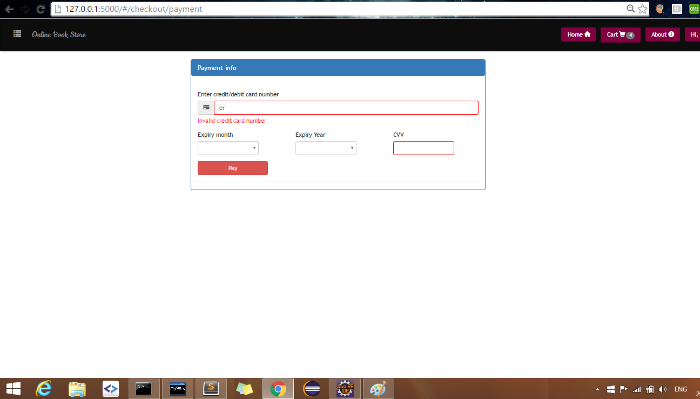
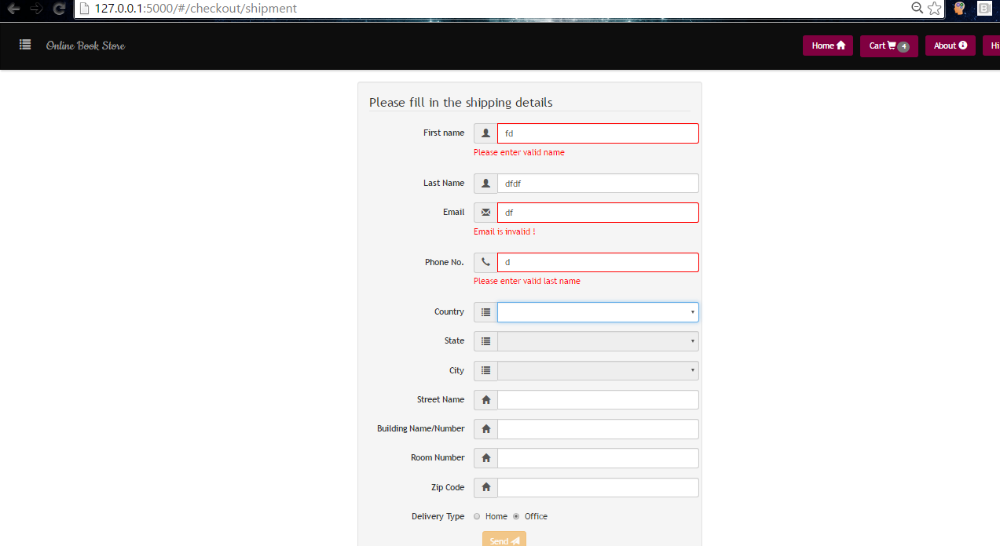

# Online-Book-Store
An online Book Store created with Python / Flask rest, MySql,Angular and Bootstrap 
Features
use of several data structures for optimization techniques
A full fledged functionality with Modules like cart, wishlist, payment, order processing 
Real time data integration from Database .
Responsive layout for extra small, Large Medium devices and browsers(ofcourse)
# How to run project locally
1. Make sure you have MYSQL version 5.7 and above since it uses full text search
2. checkout project form git 
3. open cmd and go to root of the project
4. execute "cd db"
5. execute all queries from create_tables.sql
6. on cmd go to root of project 
7. run command "python setup.py install"
8. run command python server.py

# Home Page

# Product info to be shown when user clicks on any book from booklist

# Order page when user has ordred books after payments process

# Cart details when user had few items in cart

# Category implemented with full features of filtering books by category

# Search sort and filter 

# User wishlist 

# reviews added by user for a book

# Payment process page with full validations after user fills in the shipment data  

# Shipment form with validations when user clicks on checkout 

